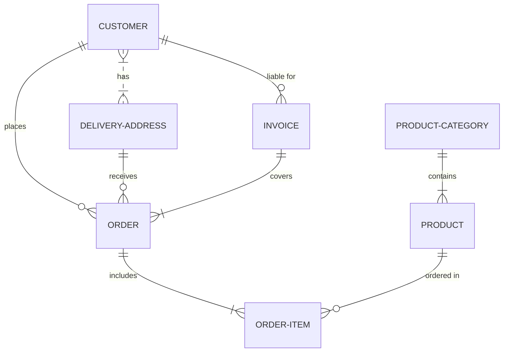

Universidad Nacional del Nordeste
Facultad de Ciencias Exactas y Naturales y Agrimensura

Asignatura: Bases de Datos I (FaCENA-UNNE)
Profesor: Darío Oscar Villegas

Proyecto de Estudio: 
Diseño e Implementación de una Base de Datos para la Gestión Interna de una Tienda de Plantas.

Autores:
Fernandez, Juan Tomás.                            LU: 56305
Román, Gabriel Esteban.                           LU: 52658
Torreani Cáceres, Jimena Soraya.                  LU: 48353
Verdichio, Nicolás Mauricio.                      LU: 56570 

Año: 2024
ÍNDICE O SUMARIO:

PORTADA/PRESENTACIÓN	1
ÍNDICE O SUMARIO:	2
CAPÍTULO I: INTRODUCCIÓN	3
   Tema	3
    Definición o Planteamiento del Problema	3
    Objetivo del Trabajo Práctico:	3
    Objetivos Generales	3
    Objetivos Específicos	3
CAPÍTULO II: MARCO CONCEPTUAL O REFERENCIAL	4
CAPÍTULO III: METODOLOGÍA SEGUIDA	4
CAPÍTULO IV: DESARROLLO DEL TEMA / PRESENTACIÓN DE RESULTADOS	5
CAPÍTULO V: CONCLUSIONES	6
BIBLIOGRAFÍA DE CONSULTA	6

CAPÍTULO I: INTRODUCCIÓN

a.Tema:
Este trabajo práctico se enfoca en el diseño e implementación de una base de datos para la gestión de una tienda de plantas que ofrece productos como plantas, macetas y herramientas o accesorios de jardinería. El propósito es resolver problemas relacionados con la administración de la tienda, como el control del inventario, la gestión de ventas y el seguimiento de clientes. El sistema que se desarrollará está orientado a optimizar estos procesos, centralizando toda la información clave en una base de datos relacional.

b. Definición o Planteamiento del Problema:
Uno de los principales desafíos de un dueño y administrador de una tienda de plantas es mantener un control preciso sobre los productos, el inventario y las ventas. La falta de un sistema de gestión adecuado para el manejo de ventas y stock ha llevado a la necesidad de mejorar la administración de los datos y optimizar la gestión del negocio.

El problema central se define como la necesidad de implementar un sistema automatizado que facilite la gestión del inventario, manteniéndolo actualizado, y permita administrar de manera eficiente el catálogo de productos y el seguimiento de clientes para, en efecto, ofrecer un manejo consistente de los datos. Lo que nos lleva a una serie de interrogantes a los que buscaremos dar respuesta en la base de datos: ¿Qué mecanismos pueden implementarse para alertar al administrador cuando el stock de un producto en específico es insuficiente o está agotado?, ¿cómo se puede garantizar la consistencia e integridad de los datos en el sistema, evitando duplicación y/o pérdida de información? y ¿qué consultas y reportes pueden generarse para facilitar la gestión diaria del inventario, las ventas y los clientes? Estas preguntas nos permitirán una mejor toma de decisiones y, en consecuencia, favorecerán las operaciones de la empresa. 
 

c. Objetivo del Trabajo Práctico:
i. Objetivo General:
Desarrollar una base de datos que resuelva las dificultades de administración de la tienda de plantas, integrando de manera eficiente la gestión de productos, ventas y clientes, garantizando la consistencia y disponibilidad de la información.
ii. Objetivos Específicos:
Diseñar un modelo de datos que refleje de manera clara y precisa las operaciones diarias de la tienda.
Implementar mecanismos de control en la base de datos para asegurar la integridad y consistencia de la información.
Desarrollar un sistema que permita realizar consultas y reportes de manera rápida, facilitando la toma de decisiones basada en datos.
Optimizar la gestión de ventas, inventario y clientes mediante la implementación de funcionalidades de registro y actualización de información.

Alcance del Proyecto:
Este proyecto, se centra en el diseño e implementación de una base de datos relacional para la gestión interna de una tienda de plantas. Para definir el alcance de nuestro trabajo hemos establecido diferentes ejes, los cuales explicitaremos a continuación:
Gestión de Productos: Planteamos hacer un registro de plantas, macetas y herramientas o accesorios de jardinería almacenando información relevante como descripción, precio, stock y especificaciones entre otros datos. Categoría de productos y control de inventario.
Gestión de Clientes: Registro y almacenamiento de la información de los clientes. Historial de compras de los clientes.
Gestión de Pedidos: Registro de pedidos realizados por los clientes. Almacenamiento de los productos incluidos en cada pedido y la cantidad solicitada.
Análisis de Ventas: Consultas sobre productos más vendidos. Registro de la cantidad de productos vendidos y los ingresos generados.
Límites del Proyecto: 
El proyecto no incluirá las siguientes áreas, ya que no forman parte del enfoque actual del sistema de ventas:
Sistema de Pagos y Facturación: No se desarrollará ningún módulo para procesar pagos o emitir facturas. Las transacciones monetarias no serán gestionadas por este sistema. El manejo de impuestos, facturación y métodos de pago (tarjeta de crédito, débito, etc.) queda fuera del alcance.
Logística de Envíos: No se incluirá la gestión de envíos o el seguimiento de los productos hasta la entrega a los clientes. El foco estará en el registro de pedidos sin incluir el procesamiento de la entrega.
Promociones y Descuentos: No se incluirán funcionalidades relacionadas con la gestión de promociones, cupones de descuento o programas de fidelización de clientes.
Estos aspectos podrían tratarse en fases posteriores, en caso de que el negocio crezca y requiera un sistema más avanzado, como la implementación de una tienda online o la integración con proveedores.

CAPÍTULO IV: DESARROLLO DEL TEMA / PRESENTACIÓN DE RESULTADOS 

Este enfoque presenta el análisis detallado del sistema de gestión para la tienda de plantas.
El propósito es que, a través de este sistema, la administración de la tienda sea más eficiente, facilitando tanto la operaciones como la toma de decisiones.
1. Modelo de Datos
El primer paso para implementar este sistema fue diseñar un modelo de datos que refleje las necesidades operativas de la tienda.
El diagrama muestra cómo las distintas áreas del negocio interactúan entre sí. La tabla de productos es esencial, ya que representa el inventario de plantas y productos relacionados. Cada producto tiene un nombre, un tipo (por ejemplo, planta, maceta, herramienta de jardinería), una cantidad disponible en stock y un precio, que son atributos fundamentales para la gestión.
Otra entidad clave es la tabla de clientes, que almacena información detallada de los compradores, permitiendo realizar un seguimiento de las compras y mejorar la experiencia del cliente mediante una atención personalizada.
En la tabla ventas conectan estos elementos, registrando cada transacción realizada. Esto no solo ayuda a llevar un control del flujo de ingresos, sino que también permite analizar el comportamiento de compra y planificar el inventario de manera más precisa.

### Diagrama relacional

### Diagrama conceptual (opcional)
Ejemplo usando Live Editor https://mermaid.js.org/ (ejemplo opcional)

### Diccionario de datos

Acceso al documento [PDF](Docs/diccionario_datos_tiendaPlantas.pdf) del diccionario de datos.
El diseño de estas tablas garantiza que cada proceso en la tienda sea registrado de manera precisa, evitando duplicidades y asegurando la integridad de los datos.

3. Análisis de Resultados
A partir de este diseño, el sistema permitirá:
Un control eficiente del inventario, con alertas cuando el stock de ciertos productos se esté agotando.
Un registro completo de los clientes, lo que permitirá personalizar las ventas y mejorar la gestión de la relación con los clientes, aumentando las oportunidades de fidelización.
Un seguimiento detallado de las ventas, permitiendo identificar patrones de compra y ajustar la oferta de productos en función de las demandas de los clientes.
Con este sistema, se optimiza tanto la operación interna de la tienda, lo que resulta en una atención  más ágil, mejor disponibilidad de productos y un servicio de mayor calidad. Estos beneficios impactan directamente en la satisfacción del cliente, ofreciéndole una experiencia más eficiente y agradable.

### Desarrollo TEMA 1 "----"

Fusce auctor finibus lectus, in aliquam orci fermentum id. Fusce sagittis lacus ante, et sodales eros porta interdum. Donec sed lacus et eros condimentum posuere. 

> Acceder a la siguiente carpeta para la descripción completa del tema [scripts-> tema_1](script/tema01_nombre_tema)

### Desarrollo TEMA 2 "----"

Proin aliquet mauris id ex venenatis, eget fermentum lectus malesuada. Maecenas a purus arcu. Etiam pellentesque tempor dictum. 

> Acceder a la siguiente carpeta para la descripción completa del tema [scripts-> tema_2](script/tema02_nombre_tema)

... 

