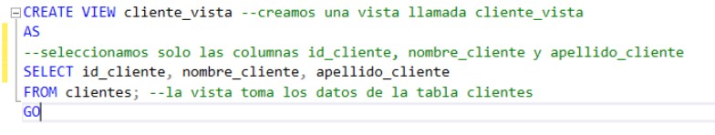

# Universidad Nacional del Nordeste
# Facultad de Ciencias Exactas y Naturales y Agrimensura

# Asignatura: Bases de Datos I (FaCENA-UNNE)
# Profesor: 
Darío Oscar Villegas

# Proyecto de Estudio: 
Diseño e Implementación de una Base de Datos para la Gestión Interna de una Tienda de Plantas.

# Autores:
Fernandez, Juan Tomás.                            LU: 56305
Román, Gabriel Esteban.                           LU: 52658
Torreani Cáceres, Jimena Soraya.                  LU: 48353
Verdichio, Nicolás Mauricio.                      LU: 56570 

# Año: 2024
# ÍNDICE O SUMARIO:

PORTADA/PRESENTACIÓN	1
ÍNDICE O SUMARIO:	2
CAPÍTULO I: INTRODUCCIÓN	3
   Tema	3
    Definición o Planteamiento del Problema	3
    Objetivo del Trabajo Práctico:	3
    Objetivos Generales	3
    Objetivos Específicos	3
CAPÍTULO II: MARCO CONCEPTUAL O REFERENCIAL	4
CAPÍTULO III: METODOLOGÍA SEGUIDA	4
CAPÍTULO IV: DESARROLLO DEL TEMA / PRESENTACIÓN DE RESULTADOS	5
CAPÍTULO V: CONCLUSIONES	6
BIBLIOGRAFÍA DE CONSULTA	6

# CAPÍTULO I: INTRODUCCIÓN

# a.Tema:
Este trabajo práctico se enfoca en el diseño e implementación de una base de datos para la gestión de una tienda de plantas que ofrece productos como plantas, macetas y herramientas o accesorios de jardinería. El propósito es resolver problemas relacionados con la administración de la tienda, como el control del inventario, la gestión de ventas y el seguimiento de clientes. El sistema que se desarrollará está orientado a optimizar estos procesos, centralizando toda la información clave en una base de datos relacional.

# b. Definición o planteamiento del problema:
Uno de los principales desafíos de un dueño y administrador de una tienda de plantas es mantener un control preciso sobre los productos, el inventario y las ventas. La falta de un sistema de gestión adecuado para el manejo de ventas y stock ha llevado a la necesidad de mejorar la administración de los datos y optimizar la gestión del negocio.

El problema central se define como la necesidad de implementar un sistema automatizado que facilite la gestión del inventario, manteniéndolo actualizado, y permita administrar de manera eficiente el catálogo de productos y el seguimiento de clientes para, en efecto, ofrecer un manejo consistente de los datos. Lo que nos lleva a una serie de interrogantes a los que buscaremos dar respuesta en la base de datos: ¿Qué mecanismos pueden implementarse para alertar al administrador cuando el stock de un producto en específico es insuficiente o está agotado?, ¿cómo se puede garantizar la consistencia e integridad de los datos en el sistema, evitando duplicación y/o pérdida de información? y ¿qué consultas y reportes pueden generarse para facilitar la gestión diaria del inventario, las ventas y los clientes? Estas preguntas nos permitirán una mejor toma de decisiones y, en consecuencia, favorecerán las operaciones de la empresa. 
 

# c. Objetivo del Trabajo Práctico:
# i. Objetivo General:
Desarrollar una base de datos que resuelva las dificultades de administración de la tienda de plantas, integrando de manera eficiente la gestión de productos, ventas y clientes, garantizando la consistencia y disponibilidad de la información.
# ii. Objetivos específicos:
Diseñar un modelo de datos que refleje de manera clara y precisa las operaciones diarias de la tienda.
Implementar mecanismos de control en la base de datos para asegurar la integridad y consistencia de la información.
Desarrollar un sistema que permita realizar consultas y reportes de manera rápida, facilitando la toma de decisiones basada en datos.
Optimizar la gestión de ventas, inventario y clientes mediante la implementación de funcionalidades de registro y actualización de información.

# Alcance del proyecto:
Este proyecto, se centra en el diseño e implementación de una base de datos relacional para la gestión interna de una tienda de plantas. Para definir el alcance de nuestro trabajo hemos establecido diferentes ejes, los cuales explicitaremos a continuación:
Gestión de Productos: Planteamos hacer un registro de plantas, macetas y herramientas o accesorios de jardinería almacenando información relevante como descripción, precio, stock y especificaciones entre otros datos. Categoría de productos y control de inventario.
Gestión de Clientes: Registro y almacenamiento de la información de los clientes. Historial de compras de los clientes.
Gestión de Pedidos: Registro de pedidos realizados por los clientes. Almacenamiento de los productos incluidos en cada pedido y la cantidad solicitada.
Análisis de Ventas: Consultas sobre productos más vendidos. Registro de la cantidad de productos vendidos y los ingresos generados.
# Límites del proyecto: 
El proyecto no incluirá las siguientes áreas, ya que no forman parte del enfoque actual del sistema de ventas:
Sistema de Pagos y Facturación: No se desarrollará ningún módulo para procesar pagos o emitir facturas. Las transacciones monetarias no serán gestionadas por este sistema. El manejo de impuestos, facturación y métodos de pago (tarjeta de crédito, débito, etc.) queda fuera del alcance.
Logística de Envíos: No se incluirá la gestión de envíos o el seguimiento de los productos hasta la entrega a los clientes. El foco estará en el registro de pedidos sin incluir el procesamiento de la entrega.
Promociones y Descuentos: No se incluirán funcionalidades relacionadas con la gestión de promociones, cupones de descuento o programas de fidelización de clientes.
Estos aspectos podrían tratarse en fases posteriores, en caso de que el negocio crezca y requiera un sistema más avanzado, como la implementación de una tienda online o la integración con proveedores.

# CAPÍTULO II: MARCO CONCEPTUAL O REFERENCIAL
Este proyecto tiene como objetivo desarrollar conocimientos y habilidades en cuanto a la implementación de conceptos técnicos clave de bases de datos, fundamentales en esta área de investigación y de gran utilidad práctica. Los temas planteados están relacionados con la seguridad y control de acceso en bases de datos, la configuración y restricción de perfiles de usuarios, la optimización y rendimiento con la que puede llegar a trabajar el motor de bases de datos en momentos de ejecución de consultas, así como la creación de procedimientos y funciones almacenadas, tanto definidos por el usuario como por el sistema. También se incluye el análisis de vistas y vistas indexadas para mejorar el acceso a los datos. 

A continuación presentaremos una explicación teórica y clara de cada uno de estos temas técnicos.

# Tema: Manejo de permisos a nivel de usuarios de base de datos.
Para administrar con facilidad los permisos en las bases de datos, SQL Server proporciona varios roles, que son las entidades de seguridad que agrupan otras entidades de seguridad. 
Se refiere al proceso de controlar y asignar qué acciones puede realizar un usuario específico dentro de una base de datos SQL Server. Esto implica determinar qué datos puede ver, modificar, eliminar o crear, así como qué comandos SQL puede ejecutar.
Para agregar y quitar usuarios en un rol de base de datos, se utiliza las opciones ADD MEMBER y DROP MEMBER de la instrucción ALTER ROLE.

Existen dos tipos de roles en el nivel de base de datos: los roles fijos de base de datos que están predefinidos en la base de datos y los roles de base de datos definidos por el usuario que el usuario puede crear.
Los roles fijos de base de datos se definen en el nivel de base de datos y existen en cada una de ellas. Los miembros de los roles de base de datos db_owner pueden administrar la pertenencia a roles fijos de base de datos.
Los permisos de los roles de base de datos definidos por el usuario se pueden personalizar con las instrucciones GRANT, DENY y REVOKE.

El manejo de permisos en SQL Server es fundamental para garantizar la seguridad y la integridad de los datos. Al comprender los conceptos básicos y las herramientas disponibles, se puede implementar una estrategia de seguridad efectiva y adecuada a las necesidades del proyecto.

# Tema: Procedimientos y funciones almacenadas.
Los procedimientos y funciones almacenadas son bloques de código SQL pre compilados y almacenados directamente en una base de datos. Esto significa que en lugar de enviar múltiples instrucciones SQL individuales a la base de datos cada vez que se necesita realizar una operación, se puede llamar a un único procedimiento o función que contiene todas las instrucciones necesarias.
Un procedimiento almacenado de SQL Server es un grupo de una o varias instrucciones Transact-SQL . Los procedimientos pueden:
Aceptar parámetros de entrada y devolver varios valores en forma de parámetros de salida al programa que realiza la llamada.
Transacciones: Los procedimientos almacenados pueden agrupar múltiples operaciones en una transacción, asegurando la integridad de los datos.
Devolver un valor de estado a un programa que realiza una llamada para indicar si la operación se ha realizado correctamente o se han producido errores, y el motivo de estos.
Funciones Almacenadas
Una función almacenada es similar a un procedimiento, pero con algunas diferencias clave:
Retorno de un valor: Una función siempre devuelve un único valor. Este valor puede ser de cualquier tipo de datos soportado por SQL Server.
Uso en expresiones: Las funciones pueden utilizarse directamente en expresiones SQL, mientras que los procedimientos requieren una instrucción EXECUTE.
Sin instrucciones de flujo de control: Las funciones están más restringidas en cuanto a las instrucciones que pueden contener. Por ejemplo, no pueden ejecutar instrucciones como INSERT, UPDATE o DELETE directamente.
Ventajas de usar Procedimientos y Funciones almacenadas
Tráfico de red reducido: Los comandos de un procedimiento se ejecutan en un único lote de código. Esto puede reducir significativamente el tráfico de red entre el servidor y el cliente porque únicamente se envía a través de la red la llamada que va a ejecutar el procedimiento. Sin la encapsulación de código que proporciona un procedimiento, cada una de las líneas de código tendría que enviarse a través de la red.
Mayor seguridad: Varios usuarios y programas cliente pueden realizar operaciones en los objetos de base de datos subyacentes a través de un procedimiento, aunque los usuarios y los programas no tengan permisos directos sobre esos objetos subyacentes. El procedimiento controla qué procesos y actividades se llevan a cabo y protege los objetos de base de datos subyacentes. Esto elimina la necesidad de conceder permisos en cada nivel de objetos y simplifica los niveles de seguridad.
La cláusula EXECUTE AS puede especificarse en la instrucción CREATE PROCEDURE para habilitar la suplantación de otro usuario o para permitir que los usuarios o las aplicaciones puedan realizar ciertas actividades en la base de datos sin necesidad de contar con permisos directos sobre los objetos y comandos subyacentes. 
Cuando una aplicación llama a un procedimiento a través de la red, solo está visible la llamada que va a ejecutar el procedimiento. Por tanto, los usuarios malintencionados no pueden ver los nombres de los objetos de la base de datos y las tablas, insertar sus propias instrucciones Transact-SQL ni buscar datos críticos.
El uso de parámetros de procedimientos ayuda a protegerse contra ataques por inyección de código SQL. Dado que la entrada de parámetros se trata como un valor literal y no como código ejecutable, resulta más difícil para un atacante insertar un comando en las instrucciones Transact-SQL del procedimiento y poner en peligro la seguridad.
Reutilización de Código: El código de cualquier operación de base de datos redundante resulta un candidato perfecto para la encapsulación de procedimientos. De este modo, se elimina la necesidad de escribir de nuevo el mismo código, se reducen las inconsistencias de código y se permite que cualquier usuario o aplicación que cuente con los permisos necesarios pueda acceder al código y ejecutarlo.
Mantenimiento más sencillo: Al centralizar la lógica de la base de datos, facilitan el mantenimiento y las actualizaciones.
Rendimiento mejorado: De forma predeterminada, un procedimiento se compila la primera vez que se ejecuta y crea un plan de ejecución que vuelve a usarse en posteriores ejecuciones.
Al estar precompilados, se ejecutan más rápido que las instrucciones SQL individuales.

Tipos de Procedimientos almacenados
Procedimientos Almacenados Definidos por el Usuario: Un procedimiento definido por el usuario se puede crear en una base de datos definida por el usuario o en todas las bases de datos del sistema excepto en la base de datos Resource. El procedimiento se puede desarrollar en Transact-SQL o como referencia a un método de Common Language Runtime (CLR) de Microsoft .NET Framework.
Procedimientos Almacenados del Sistema: Los procedimientos del sistema se incluyen con el motor de base de datos. Están almacenados físicamente en la base de datos interna y oculta Resource y se muestran de forma lógica en el esquema sys de cada base de datos definida por el sistema y por el usuario. Además, la base de datos msdb también contiene procedimientos almacenados del sistema en el esquema dbo que se usan para programar alertas y trabajos. Dado que los procedimientos del sistema empiezan con el prefijo sp_, le recomendamos que no use este prefijo cuando asigne un nombre a los procedimientos definidos por el usuario.

# Tema: Optimización de consultas mediante índices  
Los índices son estructuras de datos diseñadas para mejorar el rendimiento de las consultas y acelerar la recuperación de información en una base de datos. Funcionan de manera similar al índice de un libro, ya que permiten encontrar rápidamente la información sin necesidad de revisar todas las filas de la tabla. Se crean en una o varias columnas de una tabla y cada entrada en el índice apunta a la ubicación física de los datos en esa tabla.

Los índices nos permiten el ordenamiento de los datos de las tablas, son objetos físicos por lo tanto ocupan espacio en el disco pero menos que una tabla, porque no almacenan todos los datos de esta, sino únicamente referencias a ciertos datos claves, que ocupamos para dicha tabla. Es una copia de todas las filas, pero solamente de algunas columnas de la tabla sobre la cual definimos el índice.

Los Índices se dividen en dos tipos: 

Indices agrupados: hacen una búsqueda directa, es decir, los nodos hojas contienen las páginas de datos de la tabla.
Un índice agrupado es similar a una guía telefónica, los registros con el mismo valor de campo se agrupan juntos.

Indices no agrupados: tiene la misma estructura, pero la última fila de nodos no contiene los datos de la tabla sino contiene punteros que nos deriva a otro espacio físico donde están los datos, los punteros indican el lugar de almacenamiento de los elementos indizados en la tabla, es decir, los datos se almacenan en un lugar diferente al del índice. Llevándolo a el mismo ejemplo de la guía seria buscar primero por el índice y después acceden a la hoja donde está buscando el correspondiente dato.

# Tema: Vistas y vistas indexadas

Las vistas son tablas virtuales que permiten simplificar las consultas. Estas representan una porción de los datos almacenados en una base de datos. Decimos que son virtuales dado que no contienen datos reales, su contenido está definido por consultas que muestran una selección de columnas y filas que pueden provenir de una o varias tablas, o incluso de otras vistas dentro de la base de datos o de bases de datos externas.  Las vistas se producen de forma dinámica cuando se hace referencia a una de ellas. [refe]

Las vistas son especialmente útiles porque permiten personalizar y simplificar la percepción de la base de datos para cada usuario. Pueden emplearse como mecanismos de seguridad, mantener la compatibilidad con versiones anteriores, y optimizar el rendimiento al organizar grandes volúmenes de datos, por ejemplo, mediante el particionamiento o al ofrecer datos preseleccionados y estructurados para tareas específicas.

Entre sus ventajas, las vistas permiten:

Evitar esfuerzo duplicado al escribir una consulta una vez y acceder a los resultados cuando sea necesario.
Reducir la complejidad para uno o para otros usuarios de la base de datos mostrando solo las columnas relevantes para sus tareas. 
Proporcionar seguridad al limitar el acceso solo a ciertas columnas en una tabla ocultando datos sensibles que no deben estar disponibles para todos los usuarios.

Por otro lado, una vista indexada (o materializada) es una vista cuya definición ha sido calculada, donde los datos resultantes son almacenados físicamente como una tabla. Las vistas indexadas mejoran en gran medida el rendimiento de ciertos tipos de consultas, ya que tienen un índice asociado que acelera el procesamiento de las consultas. Este índice se crea directamente en la vista y no en las tablas base, ayudando al optimizador de consultas a encontrar los datos que necesita de forma eficiente cuando se consultan a través de la vista.

# Diferencias entre vistas y vistas indexadas

# CAPÍTULO III: METODOLOGÍA SEGUIDA

 # a. Descripción de cómo se realizó el Trabajo Práctico:

Iniciamos el proyecto charlando sobre los temas asignados, a medida que nos fuimos interiorizando comenzaron a surgir preguntas tales como:
¿En qué se diferencian los permisos a nivel de usuario con los permisos a nivel de roles del DBMS?, ¿Cómo se relacionan las vistas con la seguridad? ¿De qué forma limitan el acceso a datos sensibles? (Restricciones de integridad y visibilidad de datos), ¿Cómo se relacionan las “Vistas indexadas” con la optimización de las consultas?, ¿Cuáles son las características distintivas de las funciones y los procedimientos almacenados? Continuando con cómo podríamos aplicar lo aprendido en nuestro caso de estudio específico. Luego durante la conceptualización del problema, contextualizamos los distintos temas y diagramamos los objetivos generales y específicos como primera parte del proceso de resolución.

Se diseñó un modelo de datos relacional para una tienda de plantas, teniendo en cuenta las entidades principales (clientes, productos, pedidos) y sus relaciones. También se crearon diagramas entidad-relación (ER) para tener una visualización más clara de la estructura y las distintas relaciones entre las tablas.

Se desarrollaron las tablas y restricciones de integridad en SQL Server, enfocandonos en la eficiencia y consistencia de los datos. Establecimos claves primarias, foráneas y restricciones CHECK para validar y mantener la integridad de la información en las tablas. Creamos usuarios y configuramos roles de usuario, estableciendo permisos específicos para cada perfil de usuario en la base de datos. 
Realizaron pruebas de rendimiento y optimización de consultas mediante la implementación de índices en columnas clave y la utilización de vistas para simplificar consultas y ocultar información sensible.
Evaluamos el impacto de los índices en el rendimiento, analizando los planes de ejecución antes y después de implementar los índices. Se desarrollaron procedimientos almacenados para automatizar tareas de inserción, actualización y eliminación de registros. También creamos funciones almacenadas para cálculos específicos, como el total de ventas por cliente.

# b. Herramientas (Instrumentos y Procedimientos):

La obtención de datos se llevó a cabo mediante una búsqueda de la bibliografía especializada en el ámbito de las bases de datos y  sobré los temas introducidos por la cátedra en particular. Se recurrió a fuentes académicas, libros relevantes y artículos científicos encontrados a través de plataformas como Google Scholar. Además, se consultó la documentación oficial de Microsoft SQL Server. Este enfoque permitió recopilar información clave sobre los temas claves de base de datos relacionales, garantizando la calidad y fiabilidad de los datos utilizados en el desarrollo del trabajo.

SQL Server: Fue el motor de base de datos seleccionado para diseñar, implementar y probar la base de datos, dada su robustez en el manejo de datos relacionales y sus opciones de optimización.

SQL Server Management Studio (SSMS): Se utilizó como entorno de desarrollo para escribir consultas, procedimientos almacenados, vistas e índices, y también para visualizar los planes de ejecución y analizar el rendimiento de las consultas.

Mockaroo: Es una herramienta gratuita para generar datos de prueba y simular APIs, permitiendo crear conjuntos de datos de prueba personalizados en formatos como CSV, JSON, SQL y Excel de manera rápida y sencilla para diversas aplicaciones, facilitando pruebas más efectivas. Con ella creamos un lote de datos de 1000 registros para luego insertarlos en nuestra tabla de clientes.

ERDPlus: Es una herramienta en línea para crear Diagramas de Entidad-Relación (ERDs), Esquemas Relacionales, Esquemas Estrella y declaraciones SQL DDL. ERDPlus te permite visualizar tus diagramas de base de datos y crear tus bases de datos de manera rápida y eficiente.

Google Meet: Es una aplicación de videoconferencias de Google para navegadores web y dispositivos móviles enfocada al entorno laboral. Realizamos reuniones semanales a través de esta plataforma, donde coordinamos avances, resolvimos dudas y planificamos las próximas tareas del proyecto.

# CAPÍTULO IV: DESARROLLO DEL TEMA / PRESENTACIÓN DE RESULTADOS 

Este enfoque presenta el análisis detallado del sistema de gestión para la tienda de plantas.
El propósito es que, a través de este sistema, la administración de la tienda sea más eficiente, facilitando tanto la operaciones como la toma de decisiones.
1. Modelo de Datos
El primer paso para implementar este sistema fue diseñar un modelo de datos que refleje las necesidades operativas de la tienda.
El diagrama muestra cómo las distintas áreas del negocio interactúan entre sí. La tabla de productos es esencial, ya que representa el inventario de plantas y productos relacionados. Cada producto tiene un nombre, un tipo (por ejemplo, planta, maceta, herramienta de jardinería), una cantidad disponible en stock y un precio, que son atributos fundamentales para la gestión.
Otra entidad clave es la tabla de clientes, que almacena información detallada de los compradores, permitiendo realizar un seguimiento de las compras y mejorar la experiencia del cliente mediante una atención personalizada.
En la tabla ventas conectan estos elementos, registrando cada transacción realizada. Esto no solo ayuda a llevar un control del flujo de ingresos, sino que también permite analizar el comportamiento de compra y planificar el inventario de manera más precisa.

### Diagrama relacional

### Diccionario de datos

Acceso al documento [PDF](Docs/diccionario_datos_tiendaPlantas.pdf) del diccionario de datos.
El diseño de estas tablas garantiza que cada proceso en la tienda sea registrado de manera precisa, evitando duplicidades y asegurando la integridad de los datos.

3. Análisis de Resultados
A partir de este diseño, el sistema permitirá:
Un control eficiente del inventario, con alertas cuando el stock de ciertos productos se esté agotando.
Un registro completo de los clientes, lo que permitirá personalizar las ventas y mejorar la gestión de la relación con los clientes, aumentando las oportunidades de fidelización.
Un seguimiento detallado de las ventas, permitiendo identificar patrones de compra y ajustar la oferta de productos en función de las demandas de los clientes.
Con este sistema, se optimiza tanto la operación interna de la tienda, lo que resulta en una atención  más ágil, mejor disponibilidad de productos y un servicio de mayor calidad. Estos beneficios impactan directamente en la satisfacción del cliente, ofreciéndole una experiencia más eficiente y agradable.

# Configuración de seguridad y control de acceso

Objetivo: Implementar mecanismos de control en la base de datos para asegurar la integridad y consistencia de la información.

Roles de usuario y permisos:
Se definieron roles de usuario con permisos a nivel de usuarios que controlan el acceso a las tablas según el perfil. En las siguientes figuras se observa el procedimiento de creación de inicio de sesión, usuario y asignación de permisos de solo lectura para el usuario ‘tomas_sl’ y de administrador para el usuario ‘nicolas_adm’. 
### 

###

Se comprobó el comportamiento de los usuarios al acceder a la base de datos, verificando que los permisos asignados restringen adecuadamente las operaciones.
Ejecución de la instrucción INSERT sobre la tabla 'clientes' con el usuario con el rol sólo lectura:
###

Explicación: el usuario "tomas_sl" sólo tiene permisos de lectura y no puede modificar los datos de la tabla al intentar insertar un nuevo registro.
Ejecución de la consulta SELECT sobre la tabla clientes con el usuario ‘tomas_s’l: 
###

Ejecución de la instrucción INSERT sobre la tabla 'clientes' con el usuario con el rol de administrador:
###

Explicación: ya que db_owner es un rol que concede acceso total, los usuarios que pertenecen a este rol no están restringidos en ninguna operación dentro de la base de datos.

Implementación de vistas para control de acceso:
Para limitar el acceso directo a ciertos campos sensibles, se crearon vistas que solo muestren la información necesaria para cada tipo de usuario. En la siguiente figura se muestra un ejemplo de vista creada para exponer los detalles de clientes sin mostrar información sensible del mismo.
###

###

# Optimización de consultas:
Objetivo: Optimizar la gestión de ventas, inventario y clientes mediante la implementación de índices y vistas indexadas.

Análisis de consultas y planes de ejecución:
Se ejecutaron pruebas con y sin índices para analizar el rendimiento de las consultas clave. El gráfico 3 muestra el plan de ejecución de una consulta de pedidos antes y después de la implementación de un índice.
Se observó una reducción en el tiempo de respuesta y en el número de lecturas lógicas, lo cual confirma la efectividad de los índices en las columnas de mayor uso.

# Desarrollo de procedimientos y funciones almacenadas
Objetivo: Desarrollar procedimientos almacenados para facilitar la inserción, modificación y eliminación de registros y mejorar la eficiencia en la gestión de datos.

Procedimientos para inserción y actualización de Datos:
Se desarrollaron procedimientos almacenados que automatizan la inserción, actualización y eliminación de registros.

Funciones de cálculo:
Se crearon funciones para calcular el monto total de ventas de un cliente, para identificar a los clientes que generan mayores ingresos para el negocio, la cantidad de productos vendidos en un periodo y otros indicadores de rendimiento. En la tabla 3 se presentan los resultados de las funciones aplicadas a un conjunto de datos de prueba.

# CAPÍTULO V: CONCLUSIONES 

# Eficiencia en la consulta de datos: 
Gracias a los índices y vistas implementados pudimos mejorar el rendimiento de la base de datos, especialmente para consultas de análisis de pedidos. Esto refuerza la importancia de un diseño de índices adecuado para optimizar el acceso a la información en sistemas que manejan grandes volúmenes de datos.
# Seguridad y control de acceso: 
La estructura de permisos y roles asignados nos permitió tener un control sobre quién accede y modifica la información, protegiendo datos sensibles y mejorando también la seguridad general de la base de datos, reduciendo así el riesgo de accesos no autorizados. El uso de vistas también fue útil para dar una capa de seguridad, limitando el acceso a datos sensibles al ocultar columnas delicadas.
# Automatización de procesos: 
La implementación de procedimientos y funciones almacenadas ayudó a la automatización de tareas como la inserción, actualización y eliminación de datos. Esta automatización no solo mejora la eficiencia operativa, sino que también minimiza la posibilidad de errores que podamos cometer al momento de manipular registros, favoreciendo la consistencia de los datos.

A través de este trabajo, se logró fortalecer los conocimientos que habíamos adquirido tanto en teoría como en práctica al implementar un caso de estudio concreto. Este proyecto no solo nos ayudó a comprender mejor técnicas avanzadas en bases de datos, sino que también nos brindó una experiencia significativa en la resolución de problemas reales. Esto nos permitió afianzar habilidades fundamentales para el diseño, optimización y gestión de bases de datos.

# VI. BIBLIOGRAFÍA.

[Vistas](https://learn.microsoft.com/es-es/sql/relational-databases/views/views?view=sql-server-ver16) 

[Procedimientos almacenados (motor de base de datos)](https://learn.microsoft.com/es-es/sql/relational-databases/stored-procedures/stored-procedures-database-engine?view=sql-server-ver16)

[Roles en el nivel de base de datos](https://learn.microsoft.com/es-es/sql/relational-databases/security/authentication-access/database-level-roles?view=sql-server-ver16)

T. C. y. C. O. Begg, Database Systems: A Practical Approach to Design, Implementation, and Management, Pearson, 2015.

R. E. y. S. B. Navathe, Fundamentals of Database Systems, Pearson, 2016.

G.-M. y. U. Widom, Database Systems The Complete Book, Pearson, 2009.

Alan Beaulieu, Learning SQL Generate, Manipulate, and Retrieve Data, O’Reilly, 2020.

Anthony DeBarros, PRACTICAL SQL A Beginner’s Guide to Storytelling with Data, No Starch Press, 2018.

