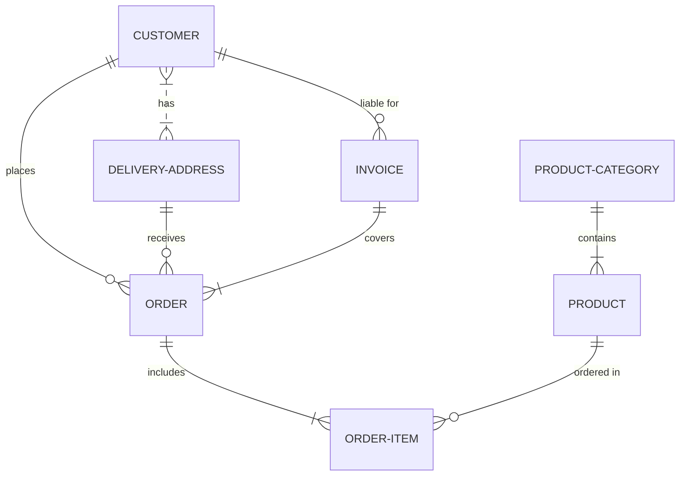

# Proyecto de Estudio!
    
**Estructura del documento principal:**

# PRESENTACIÓN (Título/Nombre Proyecto)

**Asignatura**: Bases de Datos I (FaCENA-UNNE)

**Integrantes**:
 - Gabriel Román
 - Nicolás Verdichio
 - Tomás Fernandez
 - Jimena Soraya, Torreani Cáceres

**Año**: 2024

## CAPÍTULO I: INTRODUCCIÓN

### Caso de estudio

    TIENDA ONLINE DE PLANTAS. 
a.Tema:
Título: "Desarrollo de una Tienda Online para la Venta de Plantas y Accesorios de Jardinería"
En este trabajo se investigará el diseño y la implementación de una tienda online dedicada a la venta de plantas, productos de jardinería y accesorios. El objetivo es crear una plataforma que facilite la compra de estos productos para los usuarios, garantizando una experiencia de usuario amigable y eficiente.

b.En la actualidad, el interés por las plantas ha aumentado debido a la conciencia ambiental y los beneficios del contacto con la naturaleza. Sin embargo, muchas personas no tienen acceso fácil a viveros o tiendas de jardinería locales. Además, la falta de plataformas especializadas en la venta de plantas dificulta la compra en línea de estos productos. Por tanto, el problema radica en cómo desarrollar una tienda online que no solo permita la compra de plantas de manera eficiente, sino que también ofrezca una experiencia satisfactoria para el usuario.

c. Objetivo del Trabajo Práctico:
El propósito de este trabajo es diseñar y desarrollar una tienda online que ofrezca a los usuarios la posibilidad de adquirir plantas y accesorios de jardinería de manera fácil, rápida y confiable.

i. Objetivo General:
Desarrollar una plataforma web que permita la administracion de ventas de plantas y productos de jardinería, ofreciendo a los usuarios una experiencia de compra satisfactoria.

ii. Objetivos Específicos:

Crear un catálogo de productos con información detallada sobre cada planta y accesorio.
Implementar un sistema de carrito de compras y pago en línea.
Desarrollar funcionalidades que ayuden a los usuarios a elegir las plantas más adecuadas según sus necesidades.
Proporcionar contenido educativo sobre el cuidado de las plantas a través de la plataforma.
Garantizar la seguridad y privacidad de los datos personales y financieros de los usuarios.

## CAPITULO II: MARCO CONCEPTUAL O REFERENCIAL

**TEMA 1 " ---- "** 
Ut sed imperdiet risus. Maecenas vestibulum arcu vitae orci pretium pharetra. Suspendisse potenti. Fusce massa libero, fermentum eget elit in, tincidunt fermentum nunc. Cras imperdiet nisl elit, elementum gravida enim accumsan vel. Sed in sapien quis ante consectetur commodo id non nulla. Aenean lacinia, dolor convallis semper mattis, ante orci elementum nunc, eget feugiat risus neque in urna. Ut ut quam nec risus mollis convallis ornare ac odio. Phasellus efficitur posuere nibh, eget tempor augue pellentesque ac. Ut enim sem, imperdiet non est ut, blandit posuere dui. Curabitur at purus orci. Interdum et malesuada fames ac ante ipsum primis in faucibus.

**TEMA 2 " ----- "** 
Ut sed imperdiet risus. Maecenas vestibulum arcu vitae orci pretium pharetra. Suspendisse potenti. Fusce massa libero, fermentum eget elit in, tincidunt fermentum nunc. Cras imperdiet nisl elit, elementum gravida enim accumsan vel. Sed in sapien quis ante consectetur commodo id non nulla. Aenean lacinia, dolor convallis semper mattis, ante orci elementum nunc, eget feugiat risus neque in urna. Ut ut quam nec risus mollis convallis ornare ac odio. Phasellus efficitur posuere nibh, eget tempor augue pellentesque ac. Ut enim sem, imperdiet non est ut, blandit posuere dui. Curabitur at purus orci. Interdum et malesuada fames ac ante ipsum primis in faucibus.

...

## CAPÍTULO III: METODOLOGÍA SEGUIDA 

Donec lobortis tincidunt erat, non egestas mi volutpat in. Cras ante purus, luctus sed fringilla non, ullamcorper at eros.

 **a) Cómo se realizó el Trabajo Práctico**
Vestibulum rutrum feugiat molestie. Nunc id varius augue. Ut augue mauris, venenatis et lacus ut, mattis blandit urna. Fusce lobortis, quam non vehicula scelerisque, nisi enim ultrices diam, ac tristique libero ex nec orci.

 **b) Herramientas (Instrumentos y procedimientos)**
Donec lobortis tincidunt erat, non egestas mi volutpat in. Cras ante purus, luctus sed fringilla non, ullamcorper at eros. Integer interdum id orci id rutrum. Curabitur facilisis lorem sed metus interdum accumsan. 

## CAPÍTULO IV: DESARROLLO DEL TEMA / PRESENTACIÓN DE RESULTADOS 

Maecenas molestie lacus tincidunt, placerat dolor et, ullamcorper erat. Mauris tortor nisl, ultricies ac scelerisque nec, feugiat in nibh. Pellentesque interdum aliquam magna sit amet rutrum. 

### Diagrama conceptual (opcional)
Ejemplo usando Live Editor https://mermaid.js.org/ (ejemplo opcional)

### Diagrama relacional

### Diccionario de datos

Acceso al documento [PDF](doc/diccionario_datos.pdf) del diccionario de datos.

### Desarrollo TEMA 1 "----"

Fusce auctor finibus lectus, in aliquam orci fermentum id. Fusce sagittis lacus ante, et sodales eros porta interdum. Donec sed lacus et eros condimentum posuere. 

> Acceder a la siguiente carpeta para la descripción completa del tema [scripts-> tema_1](script/tema01_nombre_tema)

### Desarrollo TEMA 2 "----"

Proin aliquet mauris id ex venenatis, eget fermentum lectus malesuada. Maecenas a purus arcu. Etiam pellentesque tempor dictum. 

> Acceder a la siguiente carpeta para la descripción completa del tema [scripts-> tema_2](script/tema02_nombre_tema)

... 

## CAPÍTULO V: CONCLUSIONES

Nunc sollicitudin purus quis ante sodales luctus. Proin a scelerisque libero, vitae pharetra lacus. Nunc finibus, tellus et dictum semper, nisi sem accumsan ligula, et euismod quam ex a tellus. 

## BIBLIOGRAFÍA DE CONSULTA

 1. List item
 2. List item
 3. List item
 4. List item
 5. List item

